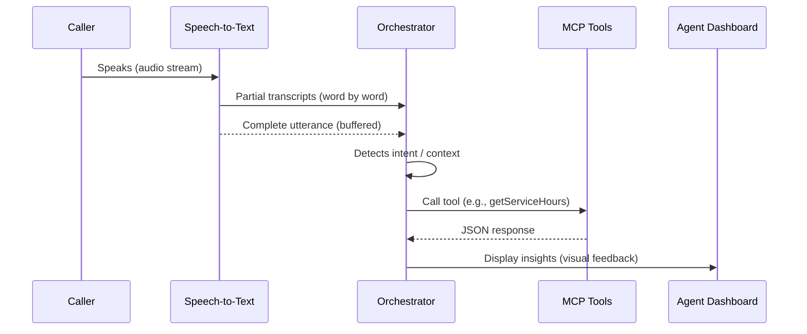

# cdmx-buildathon

## Original Hackathon Challenge

Call centers handling reservations and sales often lose opportunities when customers hang up before closing, due to manual processes, long handling times, and lack of follow-up. Agents need a copilot that supports them live and also intervenes right after the call ends to ensure each interaction has the highest probability of conversion. ### **Challenge: Build the Brain Behind Every Conversion**

Design an **AI-powered copilot** that seamlessly supports the human agent — not replaces them — throughout the entire sales journey:

1. 🎧 **Real-Time Intelligence:**

Transcribes calls live, detects buying signals, objections, or risk of drop-off.

2. 💡 **Smart Guidance:**

Suggests persuasive next moves, personalized upsells, or empathy cues based on sentiment and intent.

3. ⚡ **Instant Actions:**

Generates quotes, checks availability, and even creates reservations **on the spot**.

4. 🧩 **Seamless Handoff:**

At call end, executes the most profitable action — from sending a secure payment link to scheduling a follow-up reminder.

5. 🔁 **Always-On Follow-Up:**

Stores the full customer context and triggers a **3-step automated recovery sequence** to bring them back — until the sale is won.

## 🎯 Problem

Call centers lose sales opportunities because:

- Customers hang up before booking due to long handling times.
- Agents juggle manual processes instead of focusing on persuasion.
- Weak or missing follow-ups cause hot leads to go cold.

Agents need **real-time support**, not replacement. The copilot must **listen, guide, and assist** through every step of the sales journey — and ensure profitable follow-up.

---

## 📁 Project Structure

This repository contains two main components:

### `/cdmx-buildathon-app` - Fullstack Application

Remix-based (React Router v7) agent dashboard that provides:

- Real-time call transcript display
- Smart guidance cards with intent detection
- Action buttons for instant operations
- Visual follow-up timeline
- WebSocket integration for live updates

```
cdmx-buildathon-app/
├── app/              # Remix application routes and components
├── public/           # Static assets
├── Dockerfile        # Container configuration
├── package.json      # Node.js dependencies
└── vite.config.ts    # Build configuration
```

### `/office-hours-buildathon` - MCP Server (Palace API Integration)

Python-based MCP (Model Context Protocol) server that wraps the Palace hotel management API:

- Provides structured tools for hotel operations
- Handles reservations, availability checks, quotes, and payments
- Exposes multiple server modes (small, medium, full)
- Includes comprehensive test suite and documentation

```
office-hours-buildathon/
├── src/
│   ├── server.py           # Main MCP server
│   ├── server_http.py      # HTTP API interface
│   ├── server_small.py     # Minimal MCP server
│   ├── server_medium.py    # Medium complexity server
│   └── pricing_engine.py   # Dynamic pricing logic
├── data/                   # Mock data (reservations, properties, rooms)
├── docs/                   # API and integration documentation
├── tests/                  # Comprehensive test suite
├── examples/               # Usage examples (Python, Node.js, curl)
└── requirements.txt        # Python dependencies
```

**API Documentation**:
- **[PALACE_API_REFERENCE.md](./PALACE_API_REFERENCE.md)** - Complete REST API reference
- **[palace-api-openapi.json](./palace-api-openapi.json)** - OpenAPI 3.1 specification
- **Live Swagger Docs**: https://office-hours-buildathon.palaceresorts.com/docs

---

## 🚀 Solution

**CloseLoop** is an **AI-powered copilot** that supports call center agents during live conversations.
It integrates into the sales workflow, providing:

1. **Real-Time Intelligence** – live transcription, intent detection, objections, and drop-off risk.
2. **Smart Guidance** – empathy cues, persuasive suggestions, and upsell opportunities.
3. **Instant Actions** – availability checks, quotes, reservations, and secure payment links.
4. **Seamless Handoff** – at call end, recommend and execute the best action (payment or follow-up).
5. **Always-On Follow-Up** – schedule a 3-step automated recovery sequence to bring the customer back.

---

## 🧩 Architecture Overview

### 🎯 Real-Time Orchestration Flow

This prototype is designed to **support live agents** by providing real-time insights and tool integrations during customer calls. The system listens to ongoing conversations, interprets context, and decides which tools or APIs to invoke—without interrupting the natural flow of the call.

---

#### 1. Audio Ingestion

- **Source:** Either a live call via Twilio/Avaya or pre-recorded MP3 samples (for demo).
- **Process:** The audio stream is captured and sent to a **Speech-to-Text (STT) service** (e.g., OpenAI Realtime API, Whisper, or another provider).
- **Output:** A stream of transcribed text in near real-time.

---

#### 2. Utterance Segmentation

- STT services provide text **incrementally (word-by-word)**.
- Instead of reacting to every word, we buffer partial transcripts and wait until the model identifies a **complete utterance** (pause, sentence boundary, or semantic completion).
- This avoids unnecessary noise and ensures we work with **meaningful chunks of conversation**.

---

#### 3. Context Interpretation

- Each completed utterance is evaluated by our **Orchestrator** (a lightweight agent layer).
- The Orchestrator decides:
  - Does this utterance match a trigger (e.g., a question about hours, booking, promotions)?
  - Which **MCP tools** should be called to fetch relevant data?
  - How should the result be surfaced to the agent?

---

#### 4. MCP Integration

- The Orchestrator sends the utterance to our **custom MCP client**.
- The MCP (built in Node.js, using the hackathon repo as reference) exposes different tools:
  - Example: `getHotelInfo`, `getReservationStatus`, `getPromotions`.
- The MCP client executes the tool calls and returns structured JSON responses.

---

#### 5. Real-Time Agent Feedback

- The Orchestrator translates MCP results into a **visual UI feedback panel** for the agent.
- Example:
  - Caller: _“What time does the spa close today?”_
  - Orchestrator: Detects "spa hours" intent → Calls `getServiceHours` MCP tool → Displays **“Spa closes at 9:00 PM today”** in the agent dashboard.

---

#### 6. Demo Mode vs. Live Mode

- **Demo Mode (Hackathon):**  
  We replay MP3 call samples, feed them into STT, and trigger the flow. The agent UI shows real-time annotations as if it were a live call.
- **Live Mode (Future):**  
  Integrates directly with Twilio/Avaya APIs for real-time audio streams. Same flow applies.

---

### ✅ Clarification

When we say "decide when to call MCP," we mean:

- We are **watching the STT output** for completed utterances.
- Once an utterance is stable and semantically meaningful, we **send it to the Orchestrator**, which may call MCP tools.
- We **don’t send word-by-word**; instead, we operate at the **utterance level**, which balances speed and accuracy.

---

## 📊 Sequence Diagram



## ⚙️ Tech Stack

### Frontend

- Remix (React Router v7)
- Live transcript panel, guidance cards, action buttons, and follow-up timeline.

### Backend

- Node.js (custom MCP implementation, inspired by their repo).
- Palace Swagger API wrapped as MCP tools:
- checkAvailability
- generateQuote
- createReservation
- sendPaymentLink

### Database

- Postgres + Drizzle ORM
- For demo, optional — used to store LeadContext (transcript, entities, objections, quoteId, payment link, follow-up schedule).

### Telephony / Audio Input

- Demo: MP3 sample calls replayed as real-time streams.
- Plug-and-Play: Twilio Media Streams adapter for true real-time

## 🎥 Demo Flow

1. Replay Sample Call

- Transcript scrolls live.
- Chips show “intent: book”, “objection: too expensive”, “risk: medium”.

2. Smart Guidance Appears

- Card: “Customer is price sensitive → mention kids-free promo.”
- Proposed actions:
- Check availability (dates auto-detected).
- Generate quote (Junior Suite with kids-free).

3. Agent Clicks Action

- API called via MCP tool.
- Room/price shown instantly in UI.
- Option to “Send secure payment link”.

4. End of Call

- MCP recommends best follow-up.
- Post-call orchestrator schedules 3-step recovery:
  1. Immediate thank-you + secure link.
  2. Reminder in 24h.
  3. Urgency nudge in 72h.

## 📝 Implementation Notes

- Audio Replayer: ffmpeg decodes MP3 to PCM, emits 300–500ms frames to mimic live audio.
- STT: Whisper/Deepgram for transcription.
- UI Updates: WebSocket connection from orchestrator → Remix app.
- DB Models:
  - LeadContext: callId, transcript, entities, signals, objections, quoteId, paymentLink, followUps.

## 🎯 Deliverables for Hackathon

- Agent UI (Remix) with transcript + guidance cards + CTA actions.
- MCP backend with Planner→Executor→Critic loop.
- Palace API integration via MCP tools.
- Post-call orchestrator with 3-step follow-up scheduler.
- Demo script using sample MP3s, but Twilio-ready for real-world deployment.
